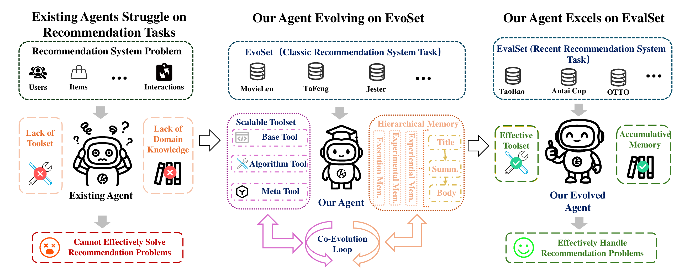
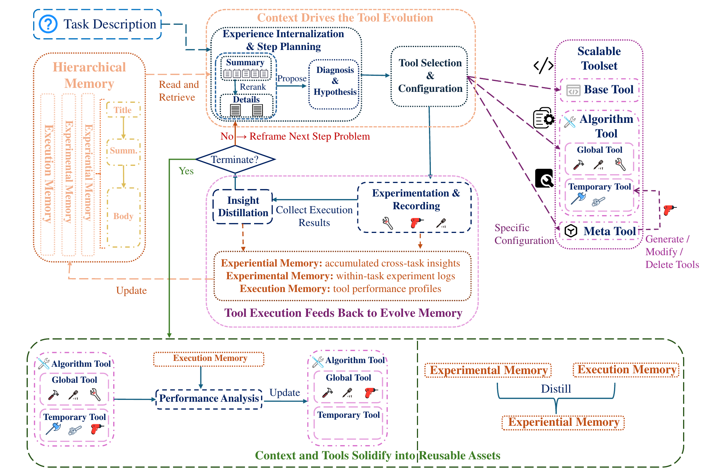
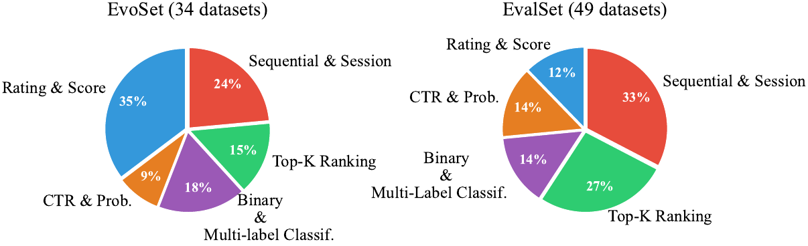

<div align="center">

# 🧬 CT-COEVO

### **C**ontext-**T**ool **Co**-**Evo**lution

**An Autonomous Agent for Recommender System Design**

<br>

[](https://www.python.org/)
[](LICENSE)

<br>



<p><i>
Existing agents lack recommendation-specific toolsets and domain knowledge, causing them to struggle on recommendation tasks.
CT-COEVO addresses this through context–tool co-evolution on RecDevBench's EvoSet (warm-up) and EvalSet (evaluation).
</i></p>

</div>

---

## 📖 Table of Contents

- [Overview](#-overview)
- [Architecture](#-architecture)
- [Project Structure](#-project-structure)
- [Installation](#-installation)
- [Usage](#-usage)
- [Key Mechanisms](#-key-mechanisms)
- [Benchmark](#-benchmark)
- [Experimental Results](#-experimental-results)
- [Advanced](#-advanced)
- [License](#-license)

---

## 🎯 Overview

CT-COEVO is an autonomous LLM-based agent that tackles recommendation competitions end-to-end. Unlike existing agents that treat each task in isolation, CT-COEVO **co-evolves** two components across tasks:

- **Contextual Memory (M)** — accumulates transferable heuristics from past experiments
- **Algorithmic Toolkit (K)** — grows a library of reusable algorithm tools

This enables the agent to improve over time: lessons learned on early tasks directly boost performance on later ones.

### Why Co-Evolution?

| | Traditional Agents | CT-COEVO |
|---|---|---|
| **Memory** | None or session-only | Persistent, hierarchical (Exper. → Expt. → Exec.) |
| **Toolkit** | Fixed or ad-hoc | Scalable 4-tier system (Base → Meta → Global → Temp) |
| **Learning** | None | Cross-task transfer via memory distillation |
| **Improvement** | Resets each task | Cumulative — gets better over time |

---

## 🏗️ Architecture

<div align="center">

</div>

<br>

Each step runs a closed loop:

**Read & Retrieve & Step Planning → Tool Selection & Configuration → Experimentation → Insight Distillation**

Three co-evolution mechanisms link Hierarchical Memory (**M**) and Scalable Toolset (**K**):

1. Context drives tool evolution
2. Tool execution feeds backs to evolve memory
3. Both solidify into reusable assets

### Core Loop (Paper Eq. 1–4)

| Step | Equation | Description |
|------|----------|-------------|
| **Extract** | `E_t = Extract(q, o_{t-1}; M)` | Retrieve relevant memories |
| **Select** | `(τ_t, θ_t) = π(q, E_t; K)` | Choose tool + configuration |
| **Execute** | `o_t = Experiment(τ_t, θ_t; D)` | Run tool in isolated workspace |
| **Distill** | `M ← M ∪ {Distill(...)}` | Store results as new memories |

### Post-Task Consolidation

After each task completes:

```
┌─────────────────────────────────────────────────────────┐
│  1. Distill Experimental → Experiential memory          │
│     (transferable heuristics for future tasks)          │
│                                                         │
│  2. Promote effective Temporary tools → Global          │
│     (reusable algorithm pipelines)                      │
│                                                         │
│  3. Prune underperforming tools                         │
│     (prevent toolkit bloat)                             │
│                                                         │
│  4. Merge local state → global state                    │
│     (share across datasets)                             │
└─────────────────────────────────────────────────────────┘
```

---

## 📁 Project Structure

```
CT-COEVO/
│
├── ct_coevo/                   # Core framework
│   ├── agent.py                #   Main agent loop (Eq. 1–4)
│   ├── memory.py               #   HierarchicalContextualMemory (M)
│   ├── toolkit.py              #   ScalableAlgorithmicToolkit (K)
│   ├── prompts.py              #   Prompt templates
│   ├── grader.py               #   Grading interface (loads metric.py)
│   ├── runner.py               #   CLI entry point
│   └── coevolution_loop.py     #   Long-run coevolution engine
│
├── docs/                       # Paper figures
│   ├── overview.pdf            #   Figure 1: Motivation (vector)
│   ├── overview.png            #   Figure 1: Motivation (display)
│   ├── architecture.pdf        #   Figure 2: Architecture (vector)
│   ├── architecture.png        #   Figure 2: Architecture (display)
│   ├── bench_split.pdf         #   Figure 3: Benchmark (vector)
│   └── bench_split.png         #   Figure 3: Benchmark (display)
│
├── requirements.txt            # Python dependencies
├── LICENSE                     # MIT License
└── README.md                   # This file
```

### Key Components

| File | Description |
|------|-------------|
| `agent.py` | Core loop: extract → select → execute → distill |
| `memory.py` | Three-tier memory with markdown file storage |
| `toolkit.py` | Four-tier toolkit with promotion/pruning |
| `prompts.py` | Prompt templates |
| `grader.py` | Loads `metric.py` from benchmark to grade submissions |
| `runner.py` | CLI orchestrating 83 datasets (34 Evo + 49 Eval) |

---

## 🔧 Installation

### Prerequisites

- **Python** 3.10 or higher
- **CUDA** 11.8+ (for GPU training)
- **GPU** — recommended: 4× NVIDIA RTX 3090 (24GB each)
- **API** — an OpenAI-compatible LLM API endpoint

### Step-by-Step

```bash
# 1. Clone the repository
git clone https://github.com/YYTbit/CT-COEVO.git
cd CT-COEVO

# 2. Create conda environment
conda create -n CT-COEVO python=3.10 -y
conda activate CT-COEVO

# 3. Install dependencies
pip install -r requirements.txt

# 4. Set PYTHONPATH (parent directory of ct_coevo/)
export PYTHONPATH=$(cd .. && pwd):$PYTHONPATH
```

<details>
<summary><b>📦 What's in requirements.txt?</b></summary>

**Core (required)**:
```
openai>=1.0.0
pandas>=1.5.0
numpy>=1.21.0
```

**Optional (for agent-generated training code)**:
```
torch>=2.0.0
lightgbm>=3.3.0
xgboost>=1.6.0
implicit>=0.6.0
scikit-learn>=1.0.0
```

The core framework only needs `openai`, `pandas`, `numpy`. The optional packages are used by the agent's generated training scripts — install them if you want the agent to create GPU-based models.

</details>

---

## 🚀 Usage

### Single Dataset

```bash
python -m ct_coevo.runner \
    --mode evo \
    --dataset ml_1m \
    --api-key YOUR_API_KEY \
    --api-url https://api.example.com/v1 \
    --model deepseek-ai/DeepSeek-V3.2 \
    --timeout 86400
```

### All Datasets

```bash
python -m ct_coevo.runner \
    --mode evo \
    --dataset all \
    --api-key YOUR_API_KEY \
    --api-url https://api.example.com/v1 \
    --model deepseek-ai/DeepSeek-V3.2
```

### Command-Line Arguments

| Argument | Required | Default | Description |
|----------|----------|---------|-------------|
| `--mode` | ✅ | — | `evo` (evolution) or `eval` (evaluation) |
| `--dataset` | ✅ | — | Dataset name, or `all` |
| `--api-key` | ✅ | — | LLM API key |
| `--api-url` | — | `https://api.siliconflow.cn/v1` | API base URL |
| `--model` | — | `deepseek-ai/DeepSeek-V3.2` | Model ID |
| `--timeout` | — | `86400` | Total time limit in seconds (24h) |

### Running Long Experiments

```bash
# Start in tmux (persists across disconnects)
tmux new-session -d -s ctcoevo \
    "conda activate CT-COEVO && python -m ct_coevo.runner \
     --mode evo --dataset ml_1m \
     --api-key KEY --api-url URL --model MODEL"

# Detach: Ctrl+B, then D
# Reattach:
tmux attach -t ctcoevo
```

### Python API

```python
from ct_coevo import CTCoEvoAgent

agent = CTCoEvoAgent(
    dataset_name="ml_1m",
    data_dir="/path/to/data/public",
    api_key="YOUR_API_KEY",
    model="deepseek-ai/DeepSeek-V3.2",
    base_url="https://api.example.com/v1",
    timeout_sec=86400,
    evolve=True,   # True = evo mode, False = eval mode
)
result = agent.run()
print(f"Best score: {result['best_score']}")
```

### Checkpoint & Resume

The agent automatically saves checkpoints. To resume a crashed run:

```python
agent = CTCoEvoAgent(
    dataset_name="ml_1m",
    data_dir="/path/to/data/public",
    api_key="YOUR_API_KEY",
    model="your-model",
    base_url="https://api.example.com/v1",
    workspace_dir="/path/to/existing/workspace",  # ← Resume
)
agent.run()
```

---

## 🔬 Key Mechanisms

### Hierarchical Contextual Memory (M)

Three memory types with increasing specificity:

| Type | Symbol | What It Stores | Example |
|------|--------|----------------|---------|
| **Experiential** | `Exper.` | Transferable heuristics | "Use pairwise loss for ranking metrics" |
| **Experimental** | `Expt.` | Per-task observations | "Tried LightGBM on sparse IDs → failed" |
| **Execution** | `Exec.` | Per-tool traces | "Trained DeepFM 100 epochs, loss=0.45" |

Each memory item is stored as a markdown file:

```markdown
---
label: Exper.
title: Use pairwise loss for ranking metrics
summary: When the evaluation metric is NDCG or Recall, prefer BPR loss over BCE.
---

## Body

Detailed conditions, actions, exceptions, and evidence...
```

### Scalable Algorithmic Toolkit (K)

| Tier | Symbol | Role | Examples |
|------|--------|------|----------|
| **Base** | `K_base` | Immutable primitives | `python`, `bash` |
| **Meta** | `K_meta` | Tool-creating operations | `create_tool`, `edit_tool` |
| **Global** | `K_global` | Reviewed, reusable pipelines | `deepfm_v1`, `lightgcn` |
| **Temporary** | `K_temp` | Experimental variants | `deepfm_v2_trial` |

### Agent-Tool Interaction

The agent communicates with tools via JSON:

```json
[{
  "tool_id": "tool_1780763698112_2",
  "name": "deepfm_v1",
  "code": "import torch\nimport torch.nn as nn\n...",
  "description": "DeepFM model for CTR prediction with GPU training",
  "review_time": 1800
}]
```

| Field | Description |
|-------|-------------|
| `tool_id` | Target tool identifier |
| `name` | Tool name (for `create_tool`) |
| `code` | Complete Python training script |
| `description` | What the tool does |
| `review_time` | Seconds before returning logs. `-1` = wait forever. Default: `-1`. Recommended: `1800` (30 min) for training tasks. |

---

## 📊 Benchmark

The agent is evaluated on **83 recommendation competition datasets** spanning 5 task categories.

<div align="center">

<br>
<i>Category distribution of RecDevBench.</i>
</div>

- **EvoSet** (34 datasets, 1997–2010): Classical recommendation datasets for agent evolution
- **EvalSet** (49 datasets, 2012–2025): Recent competitions for transfer evaluation

> 📥 Datasets will be available on Google Drive (link TBD).

### Data Format

Each dataset follows a uniform structure:

```
{dataset_id}/
├── data/
│   ├── public/
│   │   ├── train.csv (or .json)
│   │   ├── test.csv (or .json)
│   │   ├── sample_submission.csv
│   │   └── description.md
│   └── private/
│       └── answers.csv          # Ground truth (hidden from agent)
└── utils/
    ├── metric.py                # Grading function
    └── prepare.py               # Data preparation script
```

---

## 📈 Experimental Results

### Two Operating Modes

| Mode | Purpose | Memory & Toolkit | Datasets |
|------|---------|------------------|----------|
| **Evo** | Build capabilities | Evolve (grow & improve) | EvoSet (34) |
| **Eval** | Test transfer | Frozen from Evo phase | EvalSet (49) |

---

## 🔬 Advanced

### State Persistence

Evolved state is stored at `ct_coevo/state/global/`:

```
state/global/
├── memory/                    # Experiential memory files
│   ├── Exper._use_pairwise_loss.md
│   ├── Exper._gpu_for_training.md
│   └── ...
└── toolkit/                   # Global tool definitions
    ├── toolkit_items.json     # Tool metadata
    ├── deepfm_v1.py           # Tool source code
    └── ...
```

### Checking Results

```bash
# Run results
cat ct_coevo/log/{dataset}-{timestamp}/results.json

# Agent reasoning (full message log)
python3 -m json.tool ct_coevo/log/{dataset}-{timestamp}/message_log.jsonl

# Checkpoint state
python3 -m json.tool ct_coevo/workspace/{dataset}-{timestamp}/checkpoint.json

# Evolved memories
ls ct_coevo/state/global/memory/

# Evolved toolkit
python3 -m json.tool ct_coevo/state/global/toolkit/toolkit_items.json
```

---

## 📄 License

This project is licensed under the **MIT License**. See [LICENSE](LICENSE) for details.
