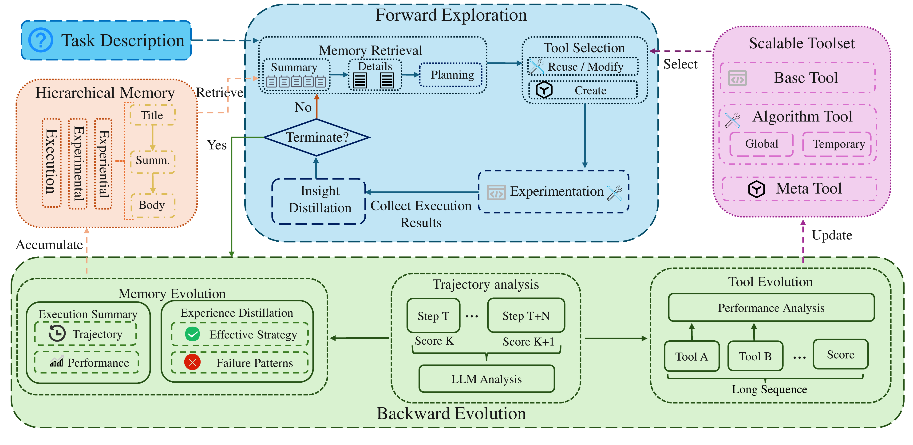
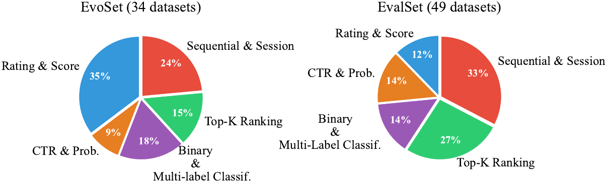

# CT-COEVO

**C**ontext-**T**ool **Co**-**Evo**lution: An Autonomous Agent for Recommender System Design via Context-Tool Co-Evolution

CT-COEVO is a self-evolving recommendation agent that jointly maintains a hierarchical contextual memory of transferable recommendation knowledge and a scalable algorithmic toolkit of executable recommender pipelines, and improves both through empirical feedback across tasks. On RecDevBench (83 datasets) it reports a 28% relative improvement over strong machine-learning agent baselines while keeping per-task API costs low.

> Implementation accompanying the paper *CT-COEVO: An Autonomous Agent for Recommender System Design via Context-Tool Co-Evolution*.

---

## 1. Overview

### Contextual Memory

The persistent memory bank M stores items as 4-tuples (title, summary, body, label) along two axes. Storage depth runs from the title to the summary to the full body, which enables coarse-to-fine retrieval, and the semantic type is one of

- **Experiential (Exper.)**, transferable heuristics and design insights,
- **Experimental (Expt.)**, per-task trial records of executed actions and outcomes,
- **Execution (Exec.)**, per-tool performance traces and failure logs that feed tool evolution.

### Algorithmic Toolkit

The toolkit is partitioned into four roles:

- **Base tools (K_base)**, execution primitives,
- **Global tools (K_global)**, pipelines that survived cross-task audits,
- **Temporary tools (K_temp)**, task-scoped experimental variants,
- **Meta tools (K_meta)**, operations that create or modify tools.

## 2. Agent Mechanism

### Forward Exploration

For each step the agent executes *Memory Retrieval, Tool Selection, Experimentation, and Insight Distillation*:

1. **Memory Retrieval.** The joint query q_t = (q, I_{t-1}) (task description plus previous-step insight) is compared against the titles of Experiential entries by cosine similarity computed with the Harrier-OSS (0.6B) embedding model. Entries above the threshold tau_1 = 0.8 return their summaries; the LLM selects the relevant subset and expands their bodies, then formulates the step plan P_t.
2. **Tool Selection.** Only tools from K_global U K_temp whose similarity to the current context (description plus execution log) exceeds tau_2 = 0.8 are offered as candidates. When no tool matches, a meta operation creates a new tool (name, description, executable code) and places it into K_temp; if execution errors occur, the error log is returned to the LLM, which modifies the tool iteratively until execution succeeds.
3. **Experimentation.** The tool runs in an isolated workspace and produces a `submission.csv`; per-step Experimental records are kept and execution outputs appended to them.
4. **Insight Distillation.** The LLM summarizes the Experimental record, analyzes each tool log into an analytical trace appended to that tool's Execution entry, and synthesizes the step insight I_t for the next iteration.

During forward exploration the agent receives only operational feedback (format checks, runtime errors); evaluation scores are never shown to the LLM.

### Backward Evolution (evolution mode only)

After a task completes, the objective scores of its submissions are revealed and the trajectory is consolidated:

1. **Trajectory analysis.** Score deltas delta_t = Score_t − Score_{t−1} are computed and the LLM produces a step-level critique c_t for each submission.
2. **Memory evolution.** Each tool's Execution history is summarized together with the score delta and the critique. Experiential heuristics are distilled under three conditions guided by the sign of delta_t (success / neutral / regression prompts). To keep the knowledge base concise, a new heuristic body is merged with existing Experiential bodies whose similarity exceeds tau_3 = 0.8; absorbed entries are removed and the consolidated body receives a new title and summary.
3. **Tool evolution.** Each successful tool call is credited with the decayed score deltas of later submissions (decay gamma = 0.9). Temporary tools with a positive relative score and no error/timeout are promoted to K_global; global tools that fail the criterion are pruned; K_temp is cleared afterwards.

Evaluation-mode runs (transfer evaluation) keep memory and toolkit frozen.

<div align="center">

<br>
<i>Architecture of CT-COEVO.</i>
</div>

---

## 3. RecDevBench

RecDevBench is a benchmark of 83 real-world recommendation datasets spanning five task families:

1. Rating & Score Prediction
2. Click-Through Rate & Probability Estimation
3. Binary & Multi-label Classification
4. Top-K Ranking & Retrieval
5. Sequential & Session-based Recommendation

Two source-separated splits:

- **EvoSet** covers 34 datasets from 1997-2010 for iterative capability accumulation. Objective scores are provided after each task to drive the evolution phase.
- **EvalSet** covers 49 datasets from 2012-2025 for transfer evaluation. Scores remain hidden so that reported performance reflects cross-task knowledge reuse.

Each task is a natural-language description plus a dataset; the agent must produce a valid `submission.csv` within a task-specific computational budget. Submissions are graded per dataset with a designated primary metric, and raw scores are mapped to a common scale by normalizing against per-dataset worst-case and best-case scores.

### Score Normalization

Metrics differ across task families, so each raw score is mapped to a common
[0, 1] scale before aggregation:

    Norm(s) = min(1, max(0, (s - S_base) / (S_best - S_base)))

where s is the raw score, S_best is the theoretical best score of the metric,
and S_base is the worst-case baseline. Examples:

- **RMSE (lower is better).** S_best = 0, which means exact prediction. S_base
  is the worst possible disagreement, which means always predicting the
  extreme opposite of the true value. On a 1-5 rating scale this is predicting
  1 where the ground truth is 5 and 5 where it is 1.
- **AUC (higher is better).** S_best = 1 and S_base = 0.5, which corresponds
  to a random ranking.
- **NDCG@K, Recall@K, MRR, and F1 (higher is better).** S_best = 1 and
  S_base = 0, which corresponds to a random ranking, no recommendation, or an
  all-negative prediction.

The reported conclusions are stable under these worst-case baselines.
Recomputing the overall ranking with raw scores, per-category z-score
normalization, or macro averaging yields the same top-ranked methods.

<div align="center">

<br>
<i>Category distribution of RecDevBench.</i>
</div>

### EvoSet (34 datasets)

| Dataset | Family | Metric | Year |
|---|---|---|---|
| `amazon_copurch` | Rank | ndcg@10 | 2003 |
| `amazon_seq` | Seq | mrr | 2003 |
| `bibsonomy` | MLC | map@k | 2007 |
| `book_crossing` | R&S | rmse | 2004 |
| `brightkite_loc` | MLC | f1 | 2009 |
| `citeulike` | MLC | f1 | 2010 |
| `delicious` | MLC | map@k | 2007 |
| `digg2009` | CTR | auc | 2009 |
| `douban_movie` | R&S | rmse | 2010 |
| `eachmovie` | R&S | rmse | 1997 |
| `epinions` | R&S | rmse | 2003 |
| `epinions_trust` | CTR | auc | 2003 |
| `flixster` | R&S | rmse | 2007 |
| `gazelle` | Seq | mrr | 2000 |
| `gowalla` | Rank | hr@10 | 2009 |
| `jester` | R&S | rmse | 1999 |
| `kdd2001` | Seq | mrr | 2001 |
| `kdd2003` | R&S | rmse | 2003 |
| `kosarak` | Seq | accuracy | 2001 |
| `lastfm_360k` | R&S | rmse | 2008 |
| `lastfm_ranking` | Rank | hr@10 | 2005 |
| `libimseti` | Rank | ndcg@10 | 2006 |
| `ml_10m` | Rank | ndcg@10 | 2009 |
| `ml_1m` | R&S | rmse | 2003 |
| `msnbc` | Seq | accuracy | 1999 |
| `netflix` | R&S | rmse | 2006 |
| `rsc2009` | Seq | mrr | 2009 |
| `slashdot_zoo` | MLC | f1 | 2009 |
| `steam_data` | R&S | rmse | 2009 |
| `tafeng` | Seq | mrr | 2000 |
| `wiki_vote` | MLC | f1 | 2008 |
| `wikispeedia` | Seq | mrr | 2009 |
| `yahoo_music_r1` | R&S | rmse | 2005 |
| `yahoo_r6a` | CTR | auc | 2009 |

### EvalSet (49 datasets)

| Dataset | Family | Metric | Year |
|---|---|---|---|
| `acquire_valued_shoppers_challenge` | MLC | auc | 2014 |
| `airbnb_recruiting_new_user_bookings` | Rank | ndcg@5 | 2016 |
| `antai_recommendation` | MLC | f1 | 2019 |
| `avazu_ctr_prediction` | CTR | logloss | 2014 |
| `beeradvocate` | R&S | rmse | 2017 |
| `criteo_display_advertising_challenge` | CTR | logloss | 2014 |
| `diginetica_session_recommendation` | Seq | recall@20 | 2016 |
| `elo_merchant_category_recommendation` | R&S | rmse | 2019 |
| `emotion_aware_music_recommendation` | Rank | recall@10 | 2022 |
| `event_recommendation_engine_challenge` | Rank | map@200 | 2013 |
| `expedia_hotel_recommendations` | Rank | map@5 | 2016 |
| `h_and_m_personalized_fashion_recommendations` | Seq | map@12 | 2022 |
| `ijcai_2018_alimama_cvr` | CTR | logloss | 2018 |
| `kdd_cup_2012_track2` | CTR | logloss | 2012 |
| `kdd_cup_2020_debiasing` | Rank | ndcg@50 | 2020 |
| `kdd_cup_2023_amazon` | Seq | recall@10 | 2023 |
| `kgrec_music_sound_recommendation` | Rank | ndcg@10 | 2024 |
| `kkbox_music_recommendation_challenge` | MLC | auc | 2017 |
| `kuairand` | Seq | recall@k | 2022 |
| `kuairec` | Rank | recall@k | 2022 |
| `lfm_1b_music_recommendation` | R&S | rmse | 2016 |
| `malanshan_video_recommendation` | Seq | mrr | 2020 |
| `matchverse_matrimonial_challenge` | Rank | mrr@100 | 2023 |
| `merrec` | Seq | mrr | 2024 |
| `otto_recommender_system` | Seq | recall@20 | 2023 |
| `outbrain_click_prediction` | Rank | map@12 | 2017 |
| `product_recommendation_2025` | Rank | ndcg@10 | 2025 |
| `ratebeer` | R&S | rmse | 2017 |
| `recsys2024_challenge` | CTR | auc | 2024 |
| `recsys_2018_spotify` | Seq | r-precision | 2018 |
| `recsys_2020_twitter` | CTR | logloss | 2020 |
| `recsys_challenge_2017` | Rank | precision@k | 2017 |
| `recsys_challenge_2019_trivago` | Seq | mrr | 2019 |
| `recsys_challenge_2022_dressipi` | Seq | mrr | 2022 |
| `rental_product_recommendation` | Seq | mrr@10 | 2024 |
| `retailrocket_recommendation` | Seq | recall@20 | 2015 |
| `santander_product_recommendation` | Rank | map@7 | 2016 |
| `social_ecommerce` | MLC | f1 | 2020 |
| `stumbleupon_evergreen_classification` | MLC | auc | 2013 |
| `taobao_recommendation` | Seq | mrr | 2018 |
| `tianchi_news_recommendation` | Seq | mrr@5 | 2020 |
| `tmall_purchase_prediction` | MLC | auc | 2015 |
| `twitch_stream_recommendation` | Rank | hit@10 | 2024 |
| `wechat_recommendation` | CTR | uauc | 2021 |
| `wsdm_2021_booking` | Seq | precision@4 | 2021 |
| `wsdm_2023_fraud_detection` | MLC | auc | 2023 |
| `yelp_recsys_2013` | R&S | rmse | 2013 |
| `yoochoose_recsys2015` | Seq | recall@20 | 2015 |
| `zomato_restaurant_recommendation` | R&S | rmse | 2019 |

---

## 4. Repository Layout

```
CT-COEVO/
├── ct_coevo/              # Implementation
│   ├── agent.py           #   forward exploration and backward evolution loop
│   ├── memory.py          #   hierarchical contextual memory (M)
│   ├── toolkit.py         #   scalable algorithmic toolkit (K)
│   ├── embedding.py       #   Harrier-OSS (0.6B) semantic embeddings
│   ├── prompts.py         #   prompt templates
│   ├── grader.py          #   grading interface (loads the dataset metric)
│   └── __init__.py
├── runner.py              # CLI entry point over RecDevBench
├── docs/                  # figures of the paper
├── requirements.txt
└── LICENSE
```

## 5. Running the Agent

```bash
pip install -r requirements.txt          # + pip install sentence-transformers for retrieval
python runner.py --mode evo  --dataset ml_1m     --api-key YOUR_API_KEY     --api-url https://api.example.com/v1     --model deepseek-ai/DeepSeek-V3.2     --timeout 86400
python runner.py --mode eval --dataset airbnb_recruiting_new_user_bookings --api-key YOUR_API_KEY
```

The command options are `--mode {evo,eval}`, `--dataset` (any of the 83 RecDevBench ids above), `--api-key`, `--api-url`, `--model`, `--harrier-model` (Harrier-OSS (0.6B) model id or local directory, or `$HARRIER_MODEL_DIR`), and `--timeout` (seconds, default 86400 = 24 h).

Benchmark data follows a uniform layout per dataset. `data/public/` holds the train file, the test file, the sample submission, and the task description. `data/private/answers.csv` holds the ground truth, which stays hidden from the agent, and `utils/metric.py` provides the grading function.

---

## License

MIT. See [LICENSE](LICENSE).
