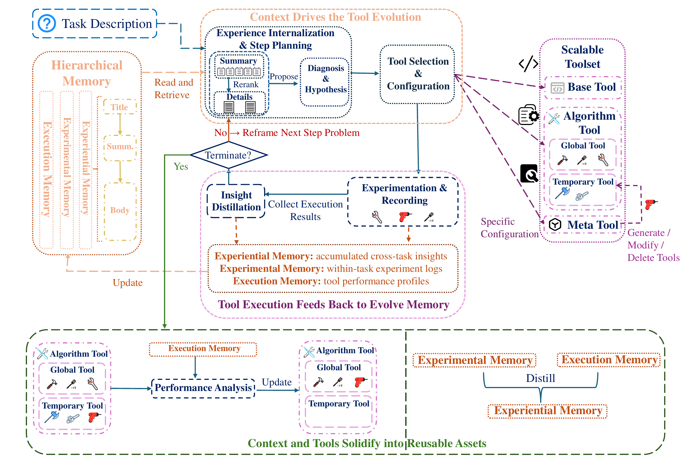

<div align="center">

# 🧬 CT-COEVO

### An Autonomous Agent for Recommender System Design via Context-Tool Co-Evolution

<p>
<a href="https://arxiv.org/abs/xxxx.xxxxx"></a>
<a href="#"></a>
<a href="#"></a>
<a href="#"></a>
</p>

<p>
<strong>CT-COEVO</strong> is an autonomous LLM-based agent that co-evolves its <em>contextual memory</em> (M) and <em>algorithmic toolkit</em> (K) across recommendation tasks to achieve state-of-the-art performance — without human intervention.
</p>



</div>

---

## 📋 Table of Contents

- [Overview](#-overview)
- [Key Innovations](#-key-innovations)
- [Project Structure](#-project-structure)
- [Installation](#-installation)
- [Quick Start](#-quick-start)
- [Running Experiments](#-running-experiments)
- [Architecture Details](#-architecture-details)
- [Benchmark Suites](#-benchmark-suites)
- [Reproducibility](#-reproducibility)
- [Citation](#-citation)

---

## 🎯 Overview

CT-COEVO addresses a fundamental challenge in automated recommender system design: **how to transfer knowledge across diverse recommendation tasks** (CTR prediction, rating prediction, ranking, multi-label classification, sequential recommendation). Unlike existing agents that treat each task in isolation, CT-COEVO maintains and evolves two core components:

| Component | Symbol | Description |
|-----------|--------|-------------|
| **Contextual Memory** | M | Hierarchical memory with three types: Experiential (transferable heuristics), Experimental (per-task observations), Execution (per-tool traces) |
| **Algorithmic Toolkit** | K | Scalable toolkit with four tiers: Base (immutable primitives), Meta (tool-creating operations), Global (reviewed pipelines), Temporary (experimental variants) |

The co-evolution follows the paper's core equations:

```
E_t = Extract(q, o_{t-1}; M)           # Eq. 1: Context extraction
(τ_t, θ_t) = π(q, E_t; K)              # Eq. 2: Tool selection & configuration
o_t = Experiment(τ_t, θ_t; D)           # Eq. 3: Execution
M ← M ∪ {Distill(q, τ_t, θ_t, o_t)}    # Eq. 4: Memory distillation
```

---

## 💡 Key Innovations

### 1. Context-Tool Co-Evolution
Unlike AIDE (tree-search) or DS-Agent (case-based reasoning), CT-COEVO **simultaneously evolves** its memory and toolkit. Successful tools get promoted to the global toolkit; failed experiments generate negative heuristics that prevent future mistakes.

### 2. Hierarchical Contextual Memory
Three-tier memory design enables coarse-to-fine retrieval:
- **Experiential (Exper.)**: Transferable heuristics distilled across tasks (e.g., "Use pairwise loss for ranking metrics")
- **Experimental (Expt.)**: Per-task observations (e.g., "LightGBM failed: sparse IDs need embeddings")
- **Execution (Exec.)**: Per-tool performance traces attached to tool records

### 3. Scalable Algorithmic Toolkit
Four-tier toolkit enables controlled growth:
- **Base (K_base)**: Immutable primitives (python, bash)
- **Meta (K_meta)**: Tool-creating operations (create_tool, edit_tool)
- **Global (K_global)**: Reviewed, reusable pipelines
- **Temporary (K_temp)**: Task-scoped experimental variants

### 4. Clean Context Architecture
Separates stable content (task description, tool definitions) from dynamic content (step history, experience context) to maximize API cache hit rates.

---

## 📁 Project Structure

```
ct_coevo/
├── agent.py              # Core agent loop (Eq. 1-4)
├── memory.py             # HierarchicalContextualMemory (M)
├── toolkit.py            # ScalableAlgorithmicToolkit (K)
├── prompts.py            # 11 prompt templates (Listings 1-11)
├── grader.py             # Grading interface (loads metric.py)
├── runner.py             # CLI entry point for all 83 datasets
├── evolution_loop.py     # Long-run evolution engine
├── state/
│   └── global/           # Shared evolved state
│       ├── memory/       # Experiential memory files (.md)
│       └── toolkit/      # Global tool definitions (.json + .py)
├── workspace/            # Per-run isolated workspaces
│   └── {dataset}-{timestamp}/
│       ├── train.json    # Symlinked from benchmark
│       ├── test.json
│       ├── sample_submission.csv
│       ├── description.md
│       ├── checkpoint.json
│       └── tool_*.py     # Generated tool code
└── log/                  # Per-run logs
    └── {dataset}-{timestamp}/
        ├── message_log.jsonl
        └── results.json
```

---

## 🔧 Installation

### Prerequisites

- Python 3.10+
- CUDA 11.8+ (for GPU training)
- NVIDIA GPU with ≥24GB VRAM (recommended: 4× RTX 3090)

### Step 1: Clone Repository

```bash
git clone https://github.com/your-org/ct-coevo.git
cd ct-coevo
```

### Step 2: Create Conda Environment

```bash
conda create -n CT-COEVO python=3.10
conda activate CT-COEVO
```

### Step 3: Install Dependencies

```bash
pip install openai pandas numpy scikit-learn torch lightgbm xgboost implicit
```

### Step 4: Install Benchmark Suites

```bash
# Install benchmark packages
cd RECDEVBENCH && pip install -e . && cd ..
cd RECGYM && pip install -e . && cd ..
cd new-rec-bench && pip install -e . && cd ..
```

### Step 5: Set PYTHONPATH

```bash
export PYTHONPATH=/path/to/parent/dir:$PYTHONPATH
```

---

## 🚀 Quick Start

### Single Dataset (Evo Mode)

```bash
cd /path/to/ct_coevo

python runner.py \
    --mode evo \
    --dataset ml_1m \
    --api-key YOUR_API_KEY \
    --api-url https://api.example.com/v1 \
    --model your-model-name \
    --timeout 86400
```

### Single Dataset (Eval Mode — Transfer Test)

```bash
python runner.py \
    --mode eval \
    --dataset airbnb_recruiting_new_user_bookings \
    --api-key YOUR_API_KEY \
    --api-url https://api.example.com/v1 \
    --model your-model-name
```

### All Datasets

```bash
python runner.py \
    --mode evo \
    --dataset all \
    --api-key YOUR_API_KEY \
    --api-url https://api.example.com/v1 \
    --model your-model-name
```

---

## 🧪 Running Experiments

### Phase 1: Evolution (EvoSet)

Evolution runs on **34 classical datasets** (1997–2010) to build memory and toolkit:

```bash
# Evolution on a single dataset
python run_evo.sh ml_1m

# Or use the runner directly
python runner.py --mode evo --dataset ml_1m \
    --api-key sk-xxx --api-url https://api.example.com/v1 --model deepseek-ai/DeepSeek-V3.2
```

During evolution:
- Memory (M) accumulates Experiential heuristics
- Toolkit (K) grows via `create_tool` and promotes effective tools to Global
- State persists at `ct_coevo/state/global/`

### Phase 2: Evaluation (EvalSet)

Evaluation runs on **49 recent competition datasets** (2012–2025) with **frozen** memory and toolkit:

```bash
python runner.py --mode eval \
    --dataset airbnb_recruiting_new_user_bookings \
    --api-key sk-xxx --api-url https://api.example.com/v1 --model deepseek-ai/DeepSeek-V3.2
```

### Checkpoint & Resume

The agent saves checkpoints after each step. To resume a crashed run:

```python
from ct_coevo import CTCoEvoAgent

agent = CTCoEvoAgent(
    dataset_name="recsys_2018_spotify",
    data_dir="/path/to/data/public",
    api_key="sk-xxx",
    model="your-model",
    base_url="https://api.example.com/v1",
    workspace_dir="/path/to/existing/workspace",  # Resume from checkpoint
)
result = agent.run()
```

### Running in tmux (Recommended for Long Runs)

```bash
# Create a start script
cat > start_agent.sh << 'EOF'
#!/bin/bash
cd /path/to/ct_coevo
source /path/to/miniconda3/bin/activate CT-COEVO
python runner.py --mode evo --dataset ml_1m \
    --api-key sk-xxx --api-url https://api.example.com/v1 --model deepseek-ai/DeepSeek-V3.2
EOF
chmod +x start_agent.sh

# Run in tmux
tmux new-session -d -s ctcoevo ./start_agent.sh

# Monitor progress
tmux attach -t ctcoevo
```

---

## 🏗️ Architecture Details

### Agent Loop (Paper Eq. 1–4)

```
┌─────────────────────────────────────────────────┐
│                  Agent Loop                      │
│                                                  │
│  Step t:                                         │
│    1. Extract: E_t = Extract(q, o_{t-1}; M)     │
│       → LLM selects K most relevant memories    │
│                                                  │
│    2. Select: (τ_t, θ_t) = π(q, E_t; K)        │
│       → LLM chooses tool + configuration        │
│       → Multi-tool parallel call supported       │
│                                                  │
│    3. Execute: o_t = Experiment(τ_t, θ_t; D)    │
│       → Run tool in isolated workspace           │
│       → review_time controls log return timing   │
│                                                  │
│    4. Distill: M ← M ∪ {Distill(...)}           │
│       → Synthesize Experimental memory           │
│       → Append Execution trace to tool record    │
│                                                  │
│  Post-task:                                      │
│    - Distill Expt. → Exper. (transferable)       │
│    - Promote/prune temp tools                    │
│    - Merge local → global state                  │
└─────────────────────────────────────────────────┘
```

### Tool Call Format

The agent outputs JSON arrays for tool selection:

```json
[
  {
    "tool_id": "tool_xxx",
    "config": {},
    "name": "deepfm_v1",
    "code": "import torch\n...",
    "description": "DeepFM for CTR prediction",
    "review_time": 1800
  }
]
```

| Field | Required | Description |
|-------|----------|-------------|
| `tool_id` | Yes | Target tool ID |
| `config` | No | Configuration parameters |
| `name` | For create_tool | Name of new tool |
| `code` | For create_tool/edit_tool | Python source code |
| `description` | For create_tool | Tool description |
| `review_time` | No | Seconds before returning logs. `-1` = wait forever. Default: `-1`. Recommended: `1800` for training. |

### Memory File Format

Each memory item is stored as a markdown file:

```markdown
---
label: Exper.
title: Use pairwise loss for ranking metrics
summary: When the evaluation metric is NDCG or Recall, use BPR loss instead of BCE.
---

## Body

Detailed heuristic body with conditions, actions, and exceptions...
```

Filename: `{label}_{sanitized_title}.md`

---

## 📊 Benchmark Suites

### EvoSet (34 datasets, 1997–2010)

| Category | Datasets | Metric |
|----------|----------|--------|
| R&S (Rating & Scoring) | ml_1m, netflix, book_crossing, douban_movie, ... | RMSE |
| CTR (Click-Through Rate) | digg2009, ml_1m_binary, netflix_binary, ... | AUC |
| MLC (Multi-Label Classification) | amazon_grocery, amazon_video, movielens_binary | F1 |
| Rank (Ranking) | amazon_beauty, gowalla, ml_10m, ... | NDCG / Recall |
| Seq (Sequential) | amazon_cds, diginetica, amazon_kindle | MRR |

### EvalSet (49 datasets, 2012–2025)

| Category | Datasets | Metric |
|----------|----------|--------|
| CTR | acquire_valued_shoppers, avazu_ctr, criteo, ... | AUC |
| R&S | beeradvocate, elo_merchant, home_depot, ... | RMSE |
| Rank | recsys_2018_spotify, expedia, h_and_m, ... | NDCG / Recall |
| MLC | airbnb, santander_product, ... | F1 / NDCG |
| Seq | diginetica_session, merrec_c2c, ... | MRR |

### Data Structure

Each competition follows a uniform structure:

```
competitions/{dataset_id}/
├── data/
│   ├── public/
│   │   ├── train.csv (or .json)
│   │   ├── test.csv (or .json)
│   │   ├── sample_submission.csv
│   │   └── description.md
│   └── private/
│       └── answers.csv          # Ground truth (never exposed to agent)
├── utils/
│   ├── metric.py                # Grading function
│   └── prepare.py               # Data preparation script
└── info/
    └── config.yaml              # Metadata (metric name, baseline score)
```

---

## 🔄 Reproducibility

### Environment

```bash
# Exact environment reproduction
conda env create -f environment.yml
conda activate CT-COEVO
```

### Random Seeds

The agent sets the following seeds for reproducibility:
- Python `random.seed(42)`
- NumPy `np.random.seed(42)`
- PyTorch `torch.manual_seed(42)`
- CUDA `torch.cuda.manual_seed_all(42)`

### API Configuration

CT-COEVO uses OpenAI-compatible APIs. Configure via:

| Parameter | Description | Example |
|-----------|-------------|---------|
| `--api-key` | API key | `sk-xxx` |
| `--api-url` | Base URL | `https://api.example.com/v1` |
| `--model` | Model ID | `deepseek-ai/DeepSeek-V3.2` |

### Expected Results

The paper reports results on 83 datasets (34 EvoSet + 49 EvalSet). Due to LLM API variability, exact scores may differ, but the agent should:

1. **Evo Mode**: Successfully complete the co-evolution loop
   - Memory grows with Experiential heuristics
   - Toolkit grows with Temporary tools; effective ones promoted to Global
   - Agent learns to use `create_tool` for training (not just `python`)

2. **Eval Mode**: Transfer evolved knowledge to new tasks
   - Agent retrieves relevant Experiential memories
   - Agent reuses Global tools from the toolkit
   - Performance should exceed task-agnostic baselines

### Checking Results

```bash
# View run results
cat ct_coevo/log/{dataset}-{timestamp}/results.json

# View message log (agent reasoning)
cat ct_coevo/log/{dataset}-{timestamp}/message_log.jsonl | python3 -m json.tool

# View checkpoint
cat ct_coevo/workspace/{dataset}-{timestamp}/checkpoint.json | python3 -m json.tool

# View evolved memory
ls ct_coevo/state/global/memory/

# View evolved toolkit
cat ct_coevo/state/global/toolkit/toolkit_items.json | python3 -m json.tool
```

---

## 📜 Citation

```bibtex
@inproceedings{ct-coevo-2025,
    title     = {CT-COEVO: An Autonomous Agent for Recommender System Design via Context-Tool Co-Evolution},
    author    = {Anonymous Authors},
    booktitle = {Proceedings of the 2025 Conference on Empirical Methods in Natural Language Processing (EMNLP)},
    year      = {2025}
}
```

---

## 📄 License

This project is licensed under the MIT License. See [LICENSE](LICENSE) for details.

---

<div align="center">

**[Paper](https://arxiv.org/abs/xxxx.xxxxx)** ·
**[Code](https://github.com/your-org/ct-coevo)** ·
**[Benchmarks](https://github.com/your-org/rec-benchmarks)**

</div>
